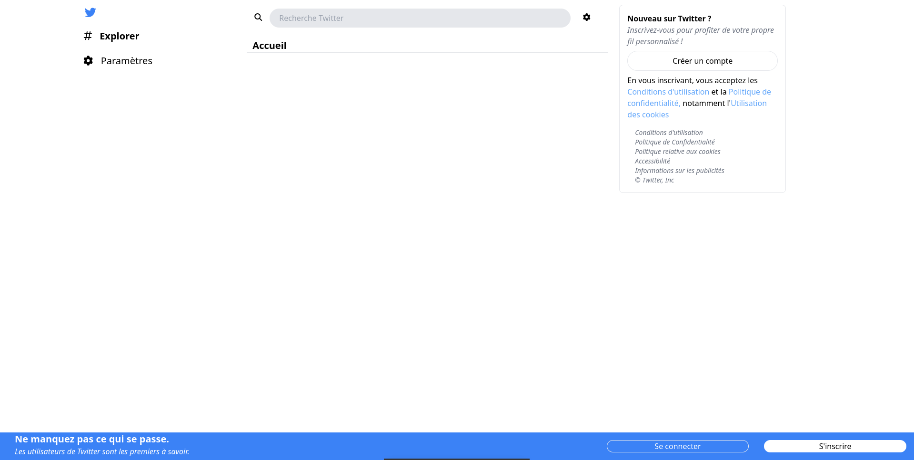
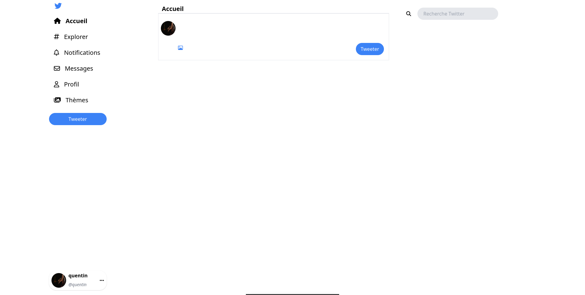
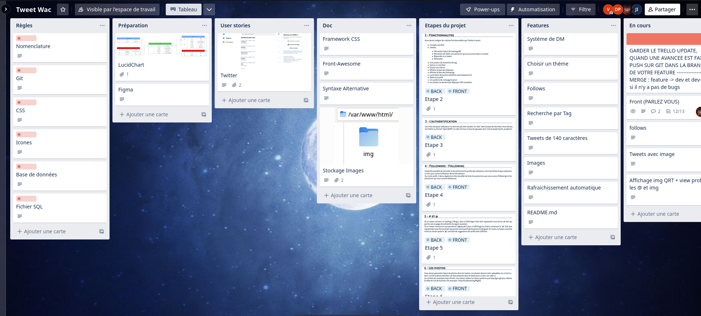
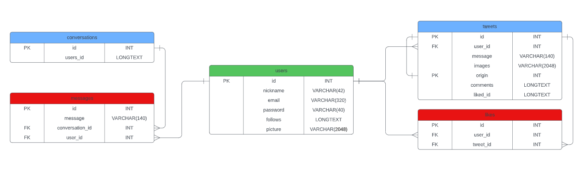

<h1 style='text-align : center;'>Twitter</h1>

Home page

----

Home page Connected

-----

<h2 style='text-align :center;'>Table of contents</h2>

<ul>
    <li><a href='#informations'>Informations</a></li>
    <li><a href='#organisation'>Organisation</a></li>
    <li><a href='#contributors'>Contributors</a></li>
</ul>

----

<h3 style='text-align :center' id='informations'>Informations</h3>

We are a group of 4 students, and we had to create a Twitter, for our Web Project module during our first year at Epitech

We had 4 weeks in order to do so, with his basic features, like : 

- Tweet 
- Retweet
- Like 
- Dislike 
- User Profil
- ...

By using languages like :

- Ajax
- PHP
- Css framework : Tailwind
- SQL (with relational tables)

We also have the common database in our promo

----

<h3 style='text-align : center;' id='organisation'>Organisation</h3>

For this project, we made a trello

<a href='https://trello.com/b/dPA7BzJp/tweet-wac'>

 
    Trello

</a>

We also used a LucidChart, in order to structure our database

And, we made a model on our website, with Figma

<a href='https://www.figma.com/file/e1t3ULb9SljD5c6DK7QXbl/Tweet-Academie?node-id=0-1&t=VcLMy9QhslG5pMC5-0'>

Figma

</a>

-----

<h3 style='text-align : center;' id='contributors'>Collaborators</h3>

[@Dorian](https://github.com/DorianEpitech)
[@Jason](https://github.com/Jason-Ikhlef)
[@Guillaume](https://github.com/Dubois-Guillaume)
[@Quentin](https://github.com/Quen2)